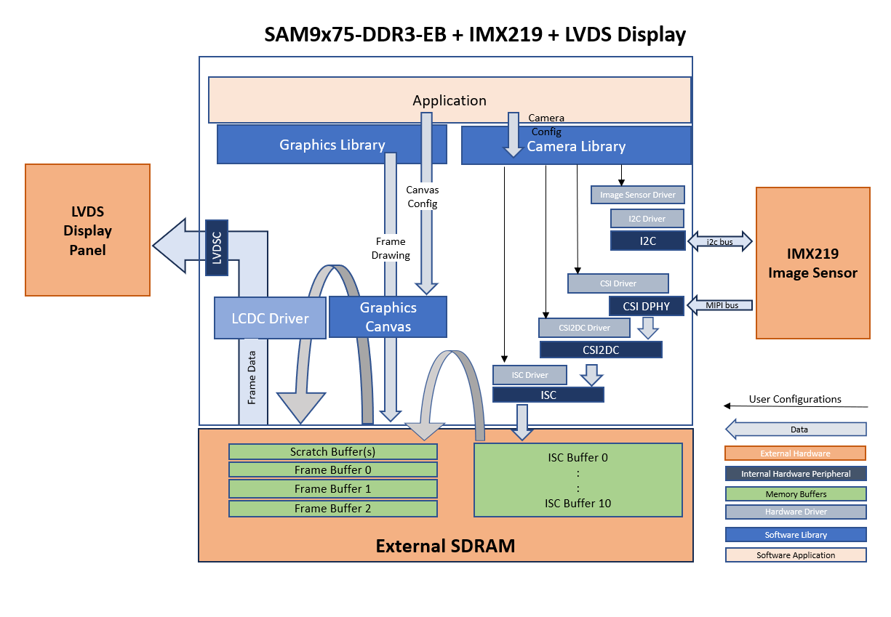
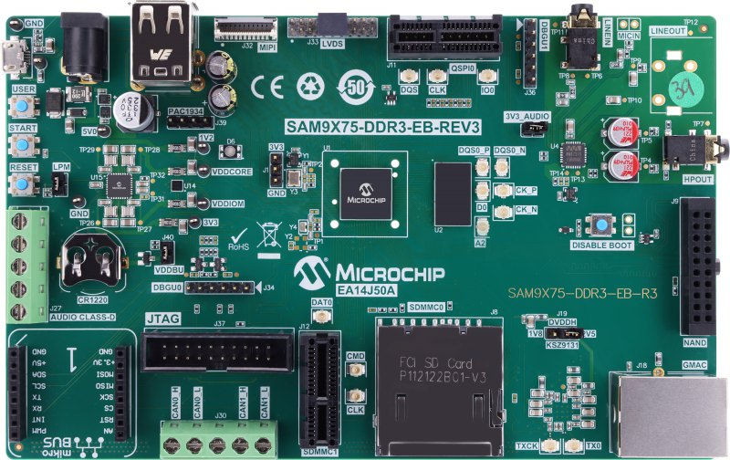
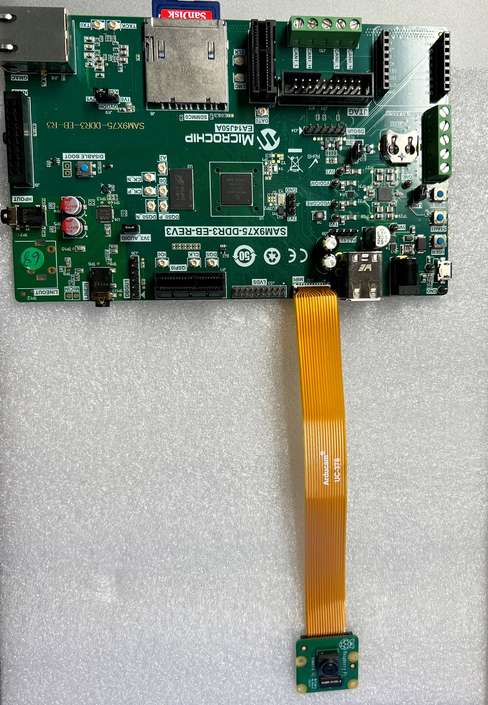

libcamera\_lvds\_sam9x75\_eb.X

Defining the Architecture
-------------------------

This application demonstrates the use of  MIPI CSI DPHY, CSI2DC, ISC and LVDS peripherals. The camera module used in this application is Sony IMX219 image sensor and AC69T88A LVDS display. This application capture raw video frames of VGA resolution from Sony IMX219 camera module using MIPI CSI2 interface and display the captured frames on the LVDS display using SAM9x75-DDR3-EB target board.

|Hardware components|Images|Details|
|:-------------------|:------------------|:------------------|
| Development Board |  | [SAM9x75-DDR3-EB](https://www.microchip.com/en-us/development-tool/EA14J50A)|
| Camera Module |  | [imx219 image sensor](https://www.raspberrypi.com/products/camera-module-v2/) |
| Ribbon Cable |  | [Ribbon Cable](https://www.amazon.com/dp/B085RW9K13?ref_=cm_sw_r_apin_dp_T969WPBQ2K966HQHVAYZ) is specifically designed for MIPI camera module with one end is 15 Pin 1.0mm Pitch interface and the other end is 22 Pin 0.5mm interface|
| AC69T88A LVDS display |  | [AC69T88A - MPU32-LVDS-DISPLAY-WVGA](https://www.microchipdirect.com/dev-tools/AC69T88A?allDevTools=true)|
| LVDS Adapter board |  | Contact Microchip sales team|

### Demonstration Features

-   Reference application for the SAM9X75-DDR3-EB Early Access Evaluation Board
-   Image Sensor Controller (ISC) driver
-   MIPI CSI2 DPHY, and CSI2DC drivers 
-   Time system service, RTT peripheral library and driver
-   Graphics Acceleration using integrated display controller (XLCDC)
-   GFX2D GPU Driver Support
-   I2C and maXTouch® controller driver

Creating the Project Graph
--------------------------

The Project Graph diagram shows the Harmony components that are included in this application. Lines between components are drawn to satisfy components that depend on a capability that another component provides.

The I2C driver in this project is used for communication with the IMX219 image sensor.

The pins are configured as follows through the MCC Pin Configuration tool:

|Pin ID|Custom Name|Function|Direction|Latch|Open Drain|PIO Interrupt|Pull Up|Pull Down|Glitch/Debounce Filter|Slew Rate|Drive Strength|
|:-----------|:-------|:----------|:----------|:----------|:----------|:-----------|:-------|:----------|:----------|:----------|:----------|
|PC20|LED_RGB_B|GPIO|Out|Low|No|Disabled|No|No|disabled|No|Low|
|PC16| |FLEXCOM10_IO0|n/a|n/a|No|Disabled|No|No|Disabled|No|Low|
|PC23|USER_BUTTON|GPIO|In|n/a|No|Disabled|No|Yes|Disabled|No|Low|
|PC0|AC69T88A_TOUCH_SDL|FLEXCOM7_IO0|n/a|n/a|No|Disabled|No|No|Disabled|No|Low|
|PC15|CAMERA_RESET|GPIO|Out|Low|No|Disabled|No|No|Disabled|No|Low|
|PC21|AC69T88A_BACKLIGHT_EN|GPIO|Out|Low|No|Disabled|No|No|Disabled|No|Low|
|PC19|LED_RGB_R|GPIO|Out|Low|No|Disabled|No|No|Disabled|No|Low|
|PC1|AC69T88A_TOUCH_SDA|FLEXCOM7_IO1|n/a|n/a|No|Disabled|No|No|Disabled|No|Low|
|PC17| |FLEXCOM10_IO1|n/a|n/a|No|Disabled|No|No|Disabled|No|Low|
|PC31|BSP_MAXTOUCH_CHG|GPIO|In|n/a|No|Disabled|No|No|Disabled|No|Low|
|PA30|AC69T88A_DISPLAY_EN|GPIO|Out|High|No|Disabled|No|No|Disabled|No|Low|
|PA27||DBGU_DTXD|n/a|n/a|No|Disabled|No|No|Disabled|No|Low|
|PA26||DBGU_DRXD|n/a|n/a|No|Disabled|No|No|Disabled|No|Low|
|PA14|AC69T88A_PWR_EN|GPIO|Out|High|No|Disabled|No|No|Disabled|No|Low|

Clock Configuration
--------------------------
The peripheral clocks need to be turned on for "CSI", "CSI2DC", "DBGU" "FLEXCOM7", "FLEXCOM10" "ISC", "XLCDC", "LVDSC", "PIOA", "PIOB", "PIOC", "PIOD" and "TC0".

The Generic clocks need to be turned on for "MIPIPHY" with GCLKCSS is set to MCK and GCLKDIV value set to 9.

The LVDSPLL is enabled with configuration values set as MUL = 20, FRACR= 3,670,016 and DIVPMC = 2

Interrupts Configuration
--------------------------
The interrupts should be enabled in the "Interrupt for "CSI", "CSI2DC", "DBGU" "FLEXCOM7", "FLEXCOM10" "ISC", "XLCDC", "LVDSC", "PIOA", "PIOB", "PIOC", "PIOD" and "TC0".

<b>Note:  The IMX219 image sensor is an off-the-shelf module and is not officially supported by MPLAB Harmony 3. While a driver for this module is included as part of this demo, it is not guaranteed to be complete. Nor are the IMX219 configuration values guaranteed to be optimal. The primary purpose of this application is to demonstrate the functionality of the CSI2DC and Image Sensor Controller modules. </b>

Project Configurations
---------------------
MPU32"s do not have an internal flash memory to boot from. Hence the boot process for these mpu's is different 
than for flash based MCUs. The boot process is described in detail in the device datasheets, but the general flow is as 
follows:
1. On power-up the device executes the first stage bootloader from internal ROM. This looks for an second stage bootloader
on external non-volatile memory such as eMMC, SD, NAND flash, NOR-SPI and QSPI as second stage boot devices. For SD and eMMC,
ROM bootloader expects a file named “boot.bin” to reside in the root directory of a FAT file system.
2. The second stage bootloader is copied to on-chip SRAM and executed. The second stage boot loader initialize the external
DRAM and its controller, then load other program from external non-volatile memory into DRAM and execute it. The second stage
bootloader must be configured for the board in use and for the external NVM containing the application.
A comprehensive description of the boot process for the Microchip MPU's can be found in this application note: 
https://ww1.microchip.com/downloads/en/AppNotes/AN2791-Booting-from-External-Non-Volatile-Memory-on-SAMA5D2-MPU-Application-Note-DS00002791A.pdf
3. The vision application is linked to run/debug on the external DRAM. During a debug process, MPLAB X will first run (load) the at91bootstrap program and this file can be found in the <project>.X folder whose function is to initialize the chip, its clocks, debug port to view log messages and initialize the external DRAM.

Below are Project configuration steps to Debug or Run Vision application.
On the MPLAB X IDE, right click on the project and click “Properties”.
1. In “Connected Hardware Tool”, select JLink or J-Tag, and in “Compiler Toolchain”, select XC32 and click apply.
2. Under Categories, click on “Bootstrap”, ensure that “Use bootstrap” is checked and the path to the bootstrap.elf file is set. 
3. The harmony.bin should be generated as a post-build command. Under Categories, click on "Building", ensure that "Execute this line after build" is checked and set "\$\{MP_CC_DIR\}/xc32-objcopy -O binary \$\{DISTDIR\}\/\$\{PROJECTNAME\}.\$\{IMAGE_TYPE\}.elf \$\{DISTDIR\}\/harmony.bin"

Building the Application
------------------------

The parent directory for this application is in vision/apps/ibcamera_display. To build this application, use MPLAB X IDE to open the vision/apps/libcamera_display/firmware/libcamera_lvds_sam9x75_eb.X project and press F11.

If the build is successfull, then a harmony.bin file is generate in vision/apps/libcamera_display/firmware/libcamera_lvds_sam9x75_eb.X/dist/imx219_mipi_csi_isc_ac69t88a/production folder.

The following table lists configuration properties:

|Project Name|BSP Used|Description|
|:-----------|:-------|:----------|
|libcamera\_lvds\_sam9x75\_eb.X|[SAM 9X75 Evaluation Board BSP](https://www.microchip.com/en-us/development-tool/EA14J50A) |[SAM9X75-DDR3-EB Early Access Evaluation Board](https://www.microchip.com/en-us/development-tool/EA14J50A) using the MIPI CSI interface to capture video frames from the [Sony IMX219 Camera Module](https://www.raspberrypi.com/products/camera-module-v2/) with [MPU32-EB-LVDS-ADAPTER](https://www.microchip.com/) and [MPU32-LVDS-Display-WVGA](https://www.microchip.com/)|

Note: For information about MPU32-EB-LVDS-ADAPTER board and MPU32-LVDS-DISPLAY-WVGA contact Microchip sales team. 

Prebuilt binaries 
-------------------------
Latest release prebuilt binaries are available for a [SAM9x75-DDR3-EB](https://www.microchip.com/en-us/development-tool/EA14J50A) board is [here](https://microchiptechnology-my.sharepoint.com/:u:/g/personal/sandeepsheriker_mallikarjun_microchip_com/ESf1f7vn_ppBhiZDlO2ptCUBkHROHfCGkuVwTCqTppLQYA?e=dccrfi)

Configuring the Hardware
------------------------

Configure the hardware as follows:

-	Connect the ribbon cable from the IMX219 camera module to the MIPI CSI connector on the SAM9x75-DDR3-EB board.

-	Connect the MPU32-EB-LVDS-ADAPTER - REV2 add-on board to the SAM 9X75 Evaluation Board. Make sure to remove any jumpers on the marked areas and start by inserting the mikroBUS header first for easy alignment.

-   Connect the AC69T88A display to the MPU32-EB-LVDS-ADAPTER-REV2 add-on board using a 30-pin 0.5mm pitch FFC ribbon.   **Important**: You may need a Type A FFC (upto REV2), or on newer LVDS-Adapter boards, a Type D FFC (contacts on opposite sides). Ultimately, you need to align pin 1 of the adapter to pin 1 of the display.

-	Take an SD Card formatted with the FAT32 file system and copy the boot.bin binary file from vision/apps/libcamera_display/firmware/libcamera_lvds_sam9x75_eb.X/binaries folder. and copy the harmony.bin file generated from the "Building the Application" section.

-   Insert the SD card into the SDMMC0 slot on the SAM9X75-DDR3-EB Early Access Evaluation Board and power up the board by connecting a USB cable (5V/1A recommended) to the USB port or an adapter to the barrel jack (5V/1A recommended, Center Positive).

-   You can optionally connect an FTDI UART to USB adapter cable to J34.

Running the Demonstration
-------------------------
The LCD should display a Live camera feed on successful power-on. See reference image.

* * * * *
