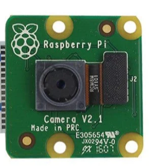
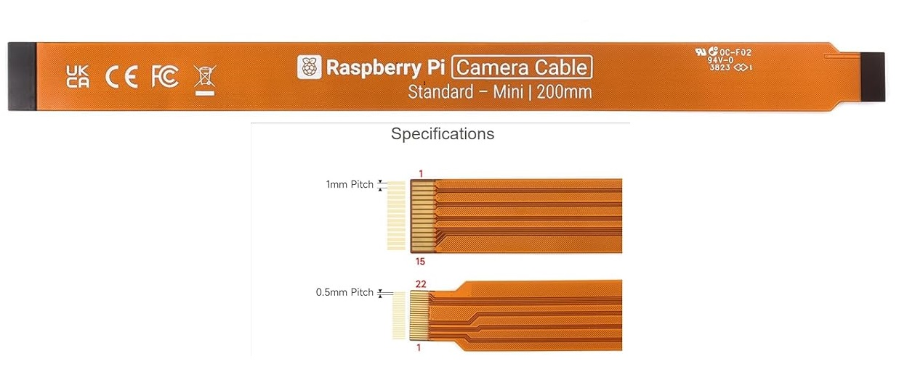
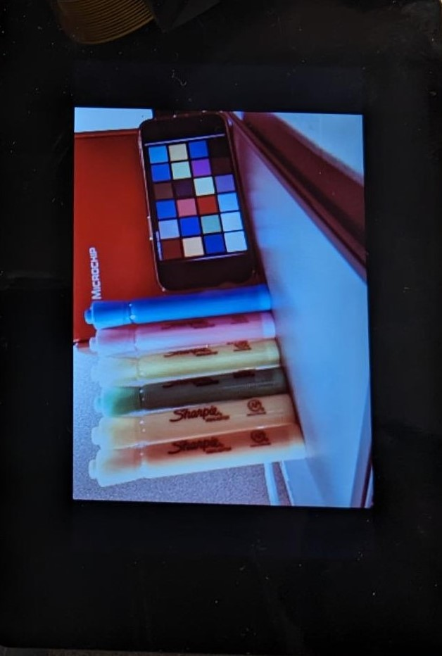

# Camera Demo using SAM9x75-DDR3-EB board

This application capture raw video frames of VGA resolution from Sony IMX219 camera module using MIPI CSI2 
interface and display the captured frames on the LVDS display using SAM9x75-DDR3-EB target board.

|MPLABX Configuration|Board Configuration|
|:-------------------|:------------------|
|[libcamera_lvds_sam9x75_eb.X](./firmware/libcamera_lvds_sam9x75_eb.X/readme.md)| [SAM9X75-DDR3-EB Early Access Evaluation Board](https://www.microchip.com/en-us/development-tool/EA14J50A) using the MIPI CSI interface to capture video frames from the [Sony IMX219 Camera Module](https://www.raspberrypi.com/products/camera-module-v2/) and display it on to the AC69T88A LVDS display |

|Hardware components|Images|Details|
|:-------------------|:------------------|:------------------|
| Development Board |  | [SAM9x75-DDR3-EB](https://www.microchip.com/en-us/development-tool/EA14J50A)|
| Camera Module |  | [imx219 image sensor](https://www.raspberrypi.com/products/camera-module-v2/) |
| Ribbon Cable |  | [Ribbon Cable](https://www.amazon.com/dp/B085RW9K13?ref_=cm_sw_r_apin_dp_T969WPBQ2K966HQHVAYZ) is specifically designed for MIPI camera module with one end is 15 Pin 1.0mm Pitch interface and the other end is 22 Pin 0.5mm interface|
| AC69T88A LVDS display |  | Contact Microchip sales team|
| LVDS Adapter board |  | Contact Microchip sales team|
