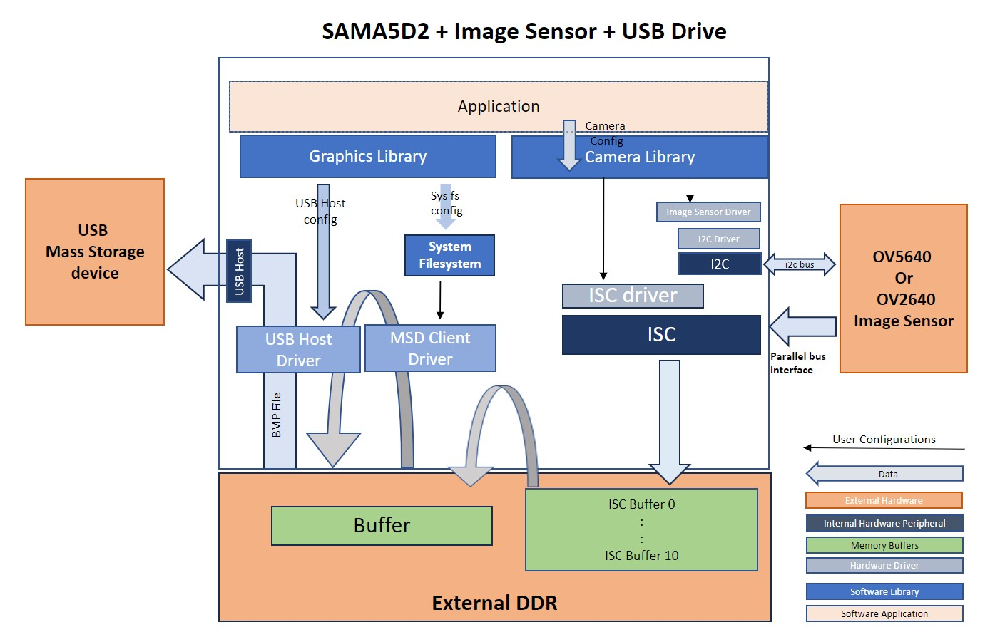
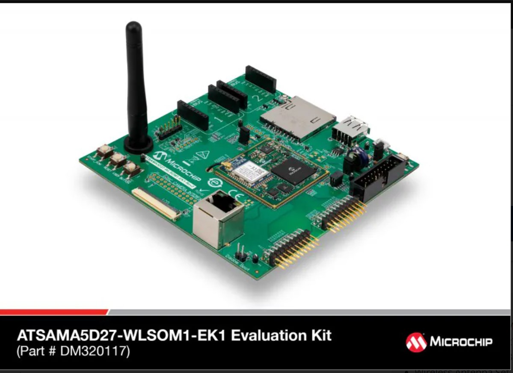
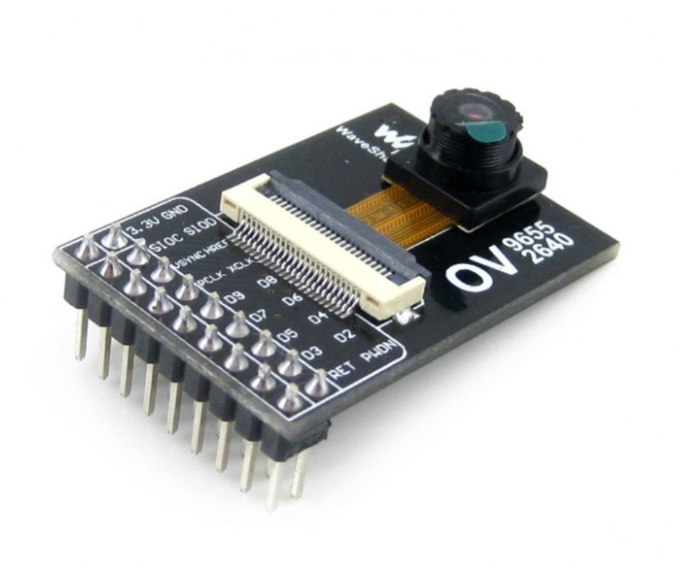
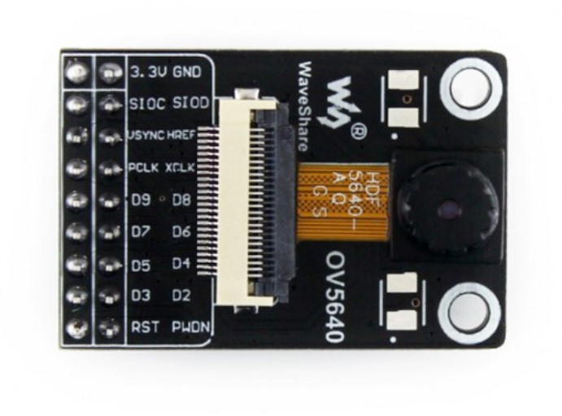
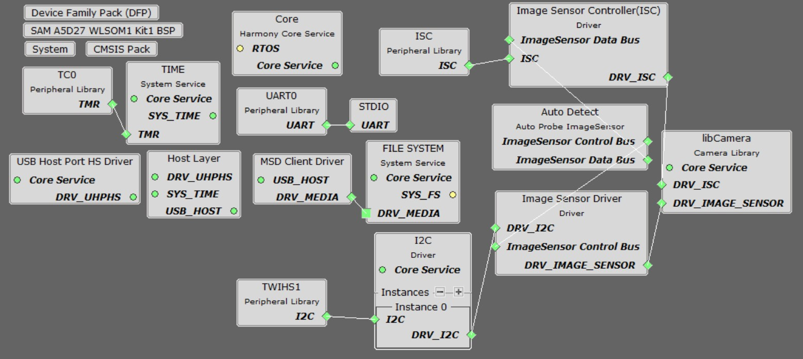
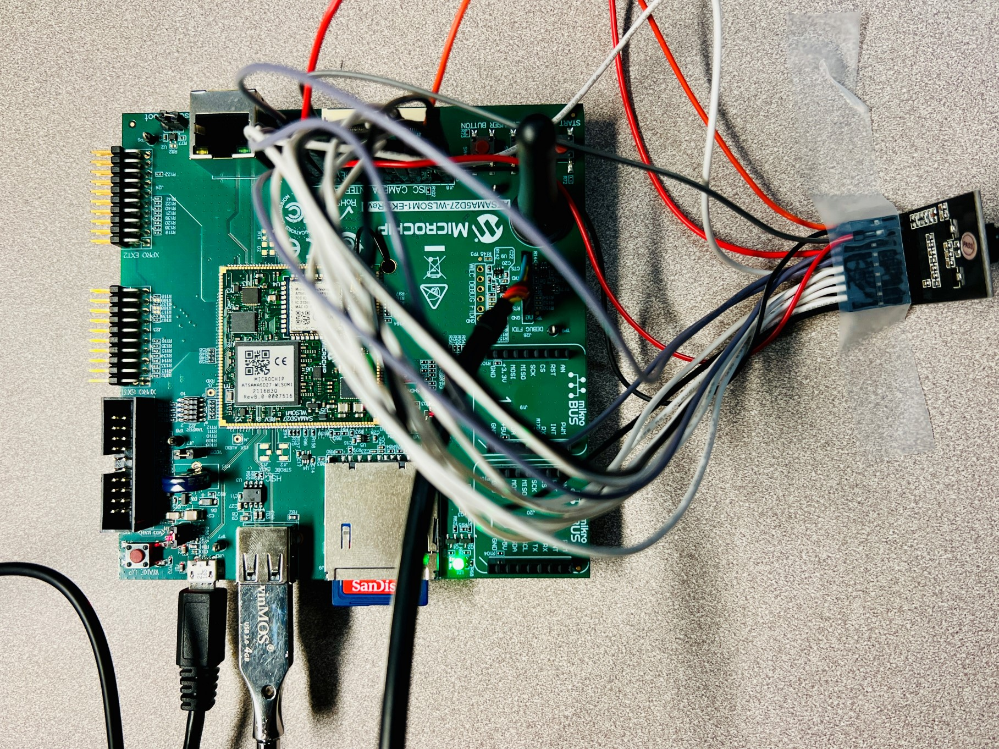

libcamera_usb_sama5d27_wlsom1_ek1.X

Defining the Architecture
-------------------------

This application demonstrates the use of ISC and USB peripherals. The camera module used in this application is ov5640 or ov2640 and USB Mass storage drive. This application capture JPEG video frame from ov5640 or raw VGA reolution from ov2640 camera module using parallel interface and captured frame is saved to a jpeg or bmp file and copied to USB drive using SAMA5D27-WLSOM1-EK1 target board.

|Hardware components|Images|Details|
|:-------------------|:------------------|:------------------|
| Development Board |  |[SAMA5D27-WLSOM1-EK1](https://www.microchip.com/en-us/development-tool/dm320117)|
| Camera Module |  | [ov2640 image sensor](https://www.waveshare.com/ov2640-camera-board.htm) [ or  Ov5640 image sensor](https://www.waveshare.com/ov5640-camera-board-a.htm)|

### Demonstration Features

-   Reference application for the SAMA5D27-WLSOM1-EK1 development Board
-   Image Sensor Controller (ISC) driver
-   Time system service, RTT/TC0 peripheral library and driver
-   USB host implementation
-   Filesystem implementation
-   Analog push button handling
-   I2C and Image sensor driver

Creating the Project Graph
--------------------------

The Project Graph diagram shows the Harmony components that are included in this application. Lines between components are drawn to satisfy components that depend on a capability that another component provides.

The I2C driver in this project is used for communication with the image sensor.

The pins are configured as follows through the MCC Pin Configuration tool:

|Pin ID|Custom Name|Function|Direction|Latch|Open Drain|PIO Interrupt|Pull Up|Pull Down|Glitch/Debounce Filter|Drive Strength|
|:-----------|:-------|:----------|:----------|:----------|:----------|:-----------|:-------|:----------|:----------|:----------|
|PA6|LED_RED|LED_AH|n/a|n/a|No|Disabled|No|No|Glitch Filter|0x0|
|PA7|LED_GREEN|LED_AH|n/a|n/a|No|Disabled|No|No|Glitch Filter|0x0|
|PA8|LED_BLUE|LED_AH|n/a|n/a|No|Disabled|No|No|Glitch Filter|0x0|
|PA9|CAMERA_RESET|GPIO|Out|High|No|Disabled|No|No|Glitch Filter|0x0|
|PA10|VBUS_AH|VBUS_AH|n/a|n/a|No|Disabled|No|No|Glitch Filter|0x0|
|PB2|USER_BUTTON|GPIO|In|n/a|No|Falling Edge|Yes|No|Glitch Filter|0x0|
|PB26| |UART0_URXD0|n/a|n/a|No|Disabled|No|No|Glitch Filter|0x0|
|PB27| |UART0_UTXD0|n/a|n/a|No|Disabled|No|No|Glitch Filter|0x0|
|PC7|CAMERA_PWD|GPIO|Out|High|No|Disabled|No|No|Glitch Filter|0x0|
|PC13| |ISC_D4|n/a|n/a|No|Disabled|No|No|Glitch Filter|0x0|
|PC14| |ISC_D5|n/a|n/a|No|Disabled|No|No|Glitch Filter|0x0|
|PC15| |ISC_D6|n/a|n/a|No|Disabled|No|No|Glitch Filter|0x0|
|PC16| |ISC_D7|n/a|n/a|No|Disabled|No|No|Glitch Filter|0x0|
|PC17| |ISC_D8|n/a|n/a|No|Disabled|No|No|Glitch Filter|0x0|
|PC18| |ISC_D9|n/a|n/a|No|Disabled|No|No|Glitch Filter|0x0|
|PC19| |ISC_D10|n/a|n/a|No|Disabled|No|No|Glitch Filter|0x0|
|PC20| |ISC_D11|n/a|n/a|No|Disabled|No|No|Glitch Filter|0x0|
|PC21| |ISC_PCK|n/a|n/a|No|Disabled|No|No|Glitch Filter|0x0|
|PC22| |ISC_VSYNC|n/a|n/a|No|Disabled|No|No|Glitch Filter|0x0|
|PC23| |ISC_HSYNC|n/a|n/a|No|Disabled|No|No|Glitch Filter|0x0|
|PC24| |ISC_MCK|n/a|n/a|No|Disabled|No|No|Glitch Filter|0x0|
|PD19| |TWIHS1_TWD1|n/a|n/a|No|Disabled|No|No|Glitch Filter|0x0|
|PD20| |TWIHS1_TWCK1|n/a|n/a|No|Disabled|No|No|Glitch Filter|0x0|

Clock Configuration
--------------------------
The peripheral clocks need to be turned on for "UART0" "TWIHS1", "MPDDRC" "ISC", "PIO" and "TC0".

The ISC clock need to be Enabled and USB HOST OHCI Clock should be enabled with USB OHCI Input source clock selected to UPLL_CLK and Divider for USB OHCI is set to 10.

Interrupts Configuration
--------------------------
The interrupts should be enabled in the "Interrupt for 

-	Enable 30 -- Two Wire Interface 1
-	Enable 35 -- TC(0, 1, 2)
-	Enable 41 -- USB High Speed 
-	Enable 46 -- Camera Inerface 
-	Enable 68 -- Parallel IO Controller

<b>Note:  The ov2640 or ov5640 image sensor is an off-the-shelf module and is not officially supported by MPLAB Harmony 3. While a driver for this module is included as part of this demo, it is not guaranteed to be complete. Nor are the ov2640 or ov5640 configuration values guaranteed to be optimal. The primary purpose of this application is to demonstrate the functionality of the Image Sensor Controller (ISC) on the SSAMA5D27-WLSOM1-EK1 board. </b>

Project Configurations
---------------------
MPU32"s do not have an internal flash memory to boot from. Hence the boot process for these mpu's is different 
than for flash based MCUs. The boot process is described in detail in the device datasheets, but the general flow is as 
follows:
1. On power-up the device executes the first stage bootloader from internal ROM. This looks for an second stage bootloader
on external non-volatile memory such as eMMC, SD, NAND flash, NOR-SPI and QSPI as second stage boot devices. For SD and eMMC,
ROM bootloader expects a file named “boot.bin” to reside in the root directory of a FAT file system.
2. The second stage bootloader is copied to on-chip SRAM and executed. The second stage boot loader initialize the external
DRAM and its controller, then load other program from external non-volatile memory into DRAM and execute it. The second stage
bootloader must be configured for the board in use and for the external NVM containing the application.
A comprehensive description of the boot process for the Microchip MPU's can be found in this application note: 
https://ww1.microchip.com/downloads/en/AppNotes/AN2791-Booting-from-External-Non-Volatile-Memory-on-SAMA5D2-MPU-Application-Note-DS00002791A.pdf
3. The vision application is linked to run/debug on the external DRAM. During a debug process, MPLAB X will first run (load) the at91bootstrap program and this file can be found in the <project>.X folder whose function is to initialize the chip, its clocks, debug port to view log messages and initialize the external DRAM.

Below are Project configuration steps to Debug or Run Vision application.
On the MPLAB X IDE, right click on the project and click “Properties”.
1. In “Connected Hardware Tool”, select JLink or J-Tag, and in “Compiler Toolchain”, select XC32 and click apply.
2. Under Categories, click on “Bootstrap”, ensure that “Use bootstrap” is checked and the path to the bootstrap.elf file is set. 
3. The harmony.bin should be generated as a post-build command. Under Categories, click on "Building", ensure that "Execute this line after build" is checked and set "\$\{MP_CC_DIR\}/xc32-objcopy -O binary \$\{DISTDIR\}\/\$\{PROJECTNAME\}.\$\{IMAGE_TYPE\}.elf \$\{DISTDIR\}\/harmony.bin"

Building the Application
------------------------

The parent directory for this application is in vision/apps/ibcamera_usb. To build this application, use MPLAB X IDE to open the vision/apps/libcamera_usb/firmware/libcamera_usb_sama5d27_wlsom1_ek1.X project and press F11.

If the build is successfull, then a harmony.bin file is generate in vision/apps/libcamera_usb/firmware/libcamera_usb_sama5d27_wlsom1_ek1.X/dist/isc_sama5d27_wlsom1_ek1_usb_msd/production folder.

The following table lists configuration properties:

|Project Name|BSP Used|Description|
|:-----------|:-------|:----------|
|libcamera_usb_sama5d27_wlsom1_ek1.X|[SAMA5D27-WLSOM1-EK1](https://www.microchip.com/en-us/development-tool/dm320117)|[SAMA5D27-WLSOM1-EK1](https://www.microchip.com/en-us/development-tool/dm320117) using the parallel interface to capture video frames from the [ov2640 image sensor](https://www.waveshare.com/ov2640-camera-board.htm) [ or  Ov5640 image sensor](https://www.waveshare.com/ov5640-camera-board-a.htm) and captured frame is saved to a bmp file and copied to USB drive.

Prebuilt binaries
-------------------------
Latest release prebuilt binaries are available for a [SAMA5D27-WLSOM1-EK1](https://www.microchip.com/en-us/development-tool/dm320117) board is [here](https://microchiptechnology-my.sharepoint.com/:u:/g/personal/sandeepsheriker_mallikarjun_microchip_com/EcJ6DBSSAV5BqYN_y8RnnLkBS07Tc_eK74mSJBuO9xJdNQ?e=7DNwKQ)

Configuring the Hardware
------------------------

Configure the hardware as follows:

-	The OV5640 or OV2640 camera module is wired to the ISC header (J18) on the SAMA5D27-WLSOM1-EK1 board using the following wiring diagram:

| Module Function | Camera Module Pin |  ISC Pin  | ISC Function |
|:---------------:|:-----------------:|:---------:|:------------:|
|       VCC       |      1            |     1     |    3.3 VCC   |
|       GND       |      2            |     2     |      GND     |
|       SCL       |      3            |  7 (PD20) |   TWI Clock  |
|       SDA       |      4            |  8 (PD19) |   TWI Data   |
|      VSYNC      |      5            | 12 (PC22) |     VSYNC    |
|       HREF      |      6            | 14 (PC23) |     HSYNC    |
|      PCLK       |      7            | 16 (PC21) |     PCLK     |
|      XCLK       |      8            | 10 (PC24) |     MCLK     |
|      DOUT9      |      9            | 25 (PC20) |      D11      |
|      DOUT8      |     10            | 24 (PC19) |      D10      |
|      DOUT7      |     11            | 23 (PC18) |      D09      |
|      DOUT6      |     12            | 22 (PC17) |      D08      |
|      DOUT5      |     13            | 21 (PC16) |      D07      |
|      DOUT4      |     14            | 20 (PC15) |      D06      |
|      DOUT3      |     15            | 19 (PC14) |      D05      |
|      DOUT2      |     16            | 18 (PC13) |      D04      |
|      DOUT1      |     17            |     ~     |              |
|      DOUT0      |     18            |     ~     |              |
|      RESET      |     19            |  5 (PA9) |     RESET    |
|      PWDN       |     20            |  6 (PC7) |     PWDN     |
|      AFVDD      |     21            |     ~     |      ~       |
|       STB       |     22            |     ~     |      ~       |

Note: 
For 8-bit image sensor data D[7:0] is aligned to ISC_D[4:11].
For 10-bit image sensor data D[9:0] is aligned to ISC_D[2:11].
For 12-bit image sensor data D[11:0] is aligned to ISC_D[0:11].

-	Take an SD Card formatted with the FAT32 file system and copy the boot.bin binary file from vision/apps/libcamera_usb/firmware/libcamera_usb_sama5d27_wlsom1_ek1.X/at91bootstrap folder. and copy the harmony.bin file generated from the "Building the Application" section.

-   Insert the SD card to J9 of the SAMA5D27-WLSOM1-EK1 board and power up the board by connecting a powered USB cable to J10 USB port on the SSAMA5D27-WLSOM1-EK1 board.

-  optionally you can capture debug messages on serial console such as teraterm or Putty  on host machine by connecting an USB to serial cable (FTDI Cable)to J26 port on the SSAMA5D27-WLSOM1-EK1 board.

Running the Demonstration
-------------------------
Press the SW3 START_SOM button to power-on the board. The Green LED will turn On and Off indicating the harmony application is running. Inserting USB stick, USB is attached and a file system is mounted. Once file system is mounted, blue LED turns ON & OFF when an image is captured and Green LED is turns ON When a BMP file or  JPEG is copied to the USB stick and Application is waiting for SW1 "USER BUTTON" event. Pressing SW1 "USER BUTTON" will capture next image. The blue LED turns ON & OFF when an image is captured and Green LED is turns ON When a BMP or JPEG file is copied to the USB stick and Application is waiting for SW1 "USER BUTTON" event to capture next frame.

Note: It will take around a second for the image to be written to the USB stick. 

* * * * *
