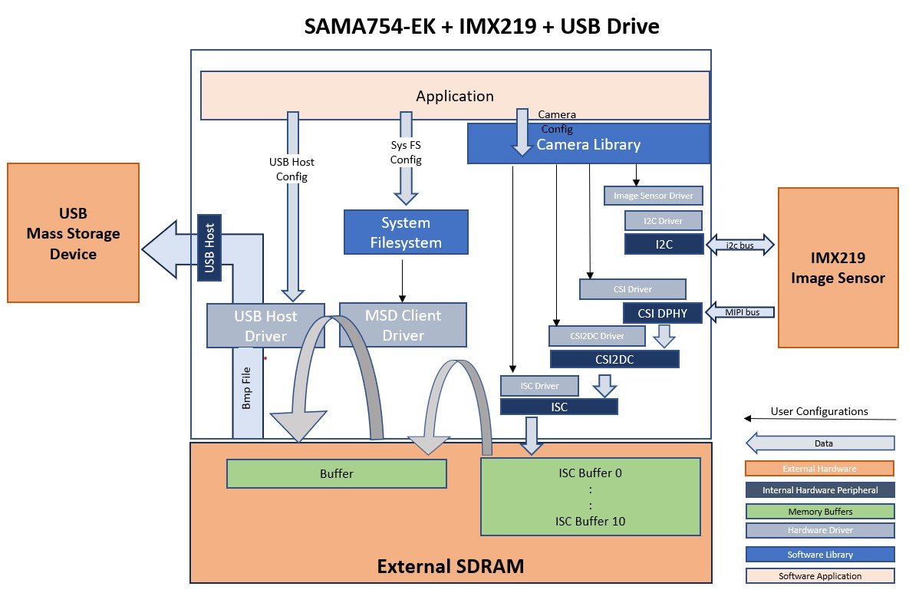
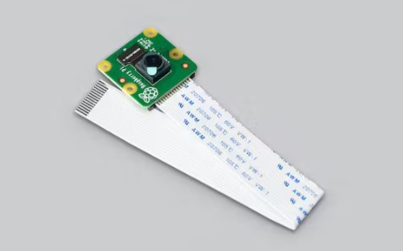
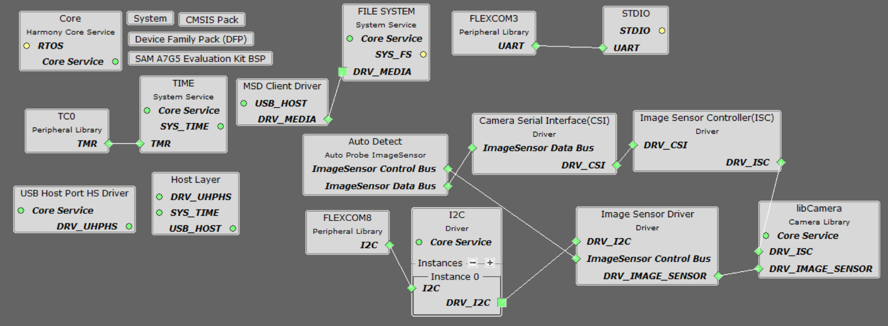
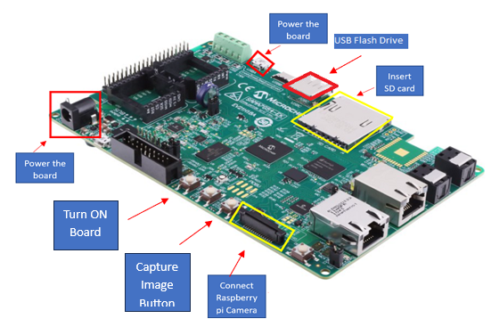
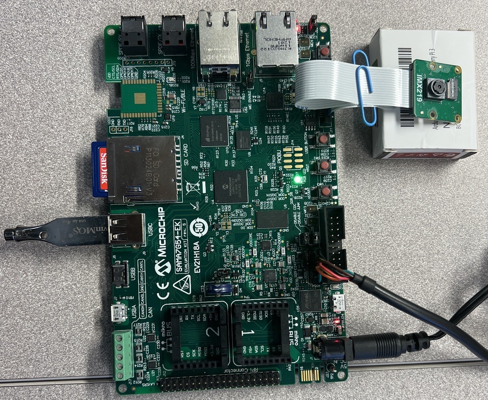

libcamera\_lvds\_sam9x75\_eb.X

Defining the Architecture
-------------------------

This application demonstrates the use of  MIPI CSI DPHY, CSI2DC, ISC and USB peripherals. The camera module used in this application is Sony IMX219 image sensor and this application capture raw video frames of VGA resolution from Sony IMX219 camera module using MIPI CSI2 
interface and captured frame is saved to a bmp file and copied it USB drive using SAMA7G54-EK target board.

 

The camera module can be purchased from [this](https://www.raspberrypi.com/products/camera-module-v2/) link.

### Demonstration Features

-   Reference application for the SAMA7G54-EK Board
-   Image Sensor Controller (ISC) driver
-   MIPI CSI2 DPHY, and CSI2DC drivers 
-   Time system service, RTT peripheral library and driver
-	USB host implementation
-	Filesystem implementation
-	Analog push button handling
-   I2C controller driver

Creating the Project Graph
--------------------------

The Project Graph diagram shows the Harmony components that are included in this application. Lines between components are drawn to satisfy components that depend on a capability that another component provides.

The I2C driver in this project is used for communication with the IMX219 image sensor.

The pins are configured as follows through the MCC Pin Configuration tool:

|Pin ID|Custom Name|Function|Direction|Latch|Open Drain|PIO Interrupt|Pull Up|Pull Down|Glitch/Debounce Filter|Drive Strength|
|:-----------|:-------|:----------|:----------|:----------|:----------|:-----------|:-------|:----------|:----------|:----------|
|PA12|USER_BUTTON|SWITCH_AL|n/a|n/a|No|Falling Edge|Yes|No|Glitch Filter|0|
|PA13|LED_GREEN|LED_AH|n/a|n/a|No|Disabled|No|No|Glitch Filter|0|
|PB2|VBUS_AH_PB2|VBUS_AH|n/a|n/a|No|Disabled|No|No|Glitch Filter|0|
|PB8|LED_RED|LED_AH|n/a|n/a|No|Disabled|No|No|Glitch Filter|0|
|PC6|VBUS_AH_PC6|VBUS_AH|n/a|n/a|No|Disabled|No|No|Glitch Filter|0|
|PC11|VBUS_AH_PC11|VBUS_AH|n/a|n/a|No|Disabled|No|No|Glitch Filter|0|
|PC13||FLEXCOM8_IO1|n/a|n/a|No|Disabled|No|No|Glitch Filter|0|
|PC14||FLEXCOM8_IO0|n/a|n/a|No|Disabled|No|No|Glitch Filter|0|
|PD16||FLEXCOM3_IO0|n/a|n/a|No|Disabled|No|No|Glitch Filter|0|
|PD17||FLEXCOM3_IO1|n/a|n/a|No|Disabled|No|No|Glitch Filter|0|
|PD20|LED_BLUE|LED_AH|n/a|n/a|No|Disabled|No|No|Glitch Filte|0|
|PE1|CAMERA_RESET|GPIO|Out|Low|No|Disabled|No|No|Glitch Filter|0|

Clock Configuration
--------------------------
The peripheral clocks need to be turned on for "CSI", "CSI2DC", "FLEXCOM8", "FLEXCOM3" "ISC", UHPHS, "PIO" and "TC0".

The Generic clocks need to be turned on for "CSI" with IMGPLL is set to GCLKCSS and GCLKDIV value set to 9.

Interrupts Configuration
--------------------------
The interrupts should be enabled in the "Interrupt for "CSI", "CSI2DC", "FLEXCOM3", "FLEXCOM8" "ISC", "UHPHS", "PIOA" and "TC0".

<b>Note:  The IMX219 image sensor is an off-the-shelf module and is not officially supported by MPLAB Harmony 3. While a driver for this module is included as part of this demo, it is not guaranteed to be complete. Nor are the IMX219 configuration values guaranteed to be optimal. The primary purpose of this application is to demonstrate the functionality of the CSI2DC and Image Sensor Controller modules. </b>

Building the Application
------------------------

The parent directory for this application is in vision/apps/ibcamera_usb. To build this application, use MPLAB X IDE to open the vision/apps/libcamera_usb/firmware/libcamera_usb_sama7g54_ek.X project and press F11.

If the build is successfull, then a harmony.bin file is generate in vision/apps/libcamera_usb/firmware/libcamera_usb_sama7g54_ek.X/dist/imx219_mipi_csi_isc_usb_msd/production folder.

The following table lists configuration properties:

|Project Name|BSP Used|Description|
|:-----------|:-------|:----------|
|libcamera_usb_sama7g54_ek.X|[SAMA7G5 Evaluation Kit BSP](https://www.microchip.com/en-us/development-tool/ev21h18a) |[SAMA7G54-EK Board](https://www.microchip.com/en-us/development-tool/ev21h18a) using the MIPI CSI interface to capture video frames from the [Sony IMX219 Camera Module](https://www.raspberrypi.com/products/camera-module-v2/)|

Configuring the Hardware
------------------------

Configure the hardware as follows:

-	Connect the ribbon cable from the raspberry pi camera module to the MIPI CSI connector on the SAMA7G5EK board.

-   Take an SD Card formatted with FAT32 file system, and copy the boot.bin binary file from this [location](vision/apps/libcamera_usb/firmware/libcamera_usb_sama7g54_ek.X/boot_image/boot.bin). Also copy the harmony.bin file you generated from the "Building the Application" section.

-   Insert the SD card to J4 of the SAMA7G5EK board and power up the board by connecting a powered USB cable to J7 or +5V wall adapter power cable to J1 on the SAMA7G5EK board.

-   You can optionally connect an FTDI UART to USB adapter cable to J20.

-   Connect USB flash drive formatted with FAT file system.

-	Power On the board by Connecting mirco USB Cable to J7 or connecting 5V power supply to J1. 

Running the Demonstration
-------------------------

Press the SW3 nSTART button to power-on the board. The green LED will turn On and Off indicating the harmony application is running. Inserting USB stick, USB is attached and a file system is mounted. Once file system is mounted, blue LED turns ON & OFF when an image is captured and Green LED is turns ON When a BMP file is copied to the USB stick and Application is waiting for SW1 "USER BUTTON" event. Pressing SW1 "USER BUTTON" to capture next image. The blue LED turns ON & OFF when an image is captured and Green LED is turns ON When a BMP file is copied to the USB stick and Application is waiting for SW1 "USER BUTTON" event to capture next frame.
 
<b>Note:  It will take around 5seconds for the image to be written to the USB stick. </b>

* * * * *
