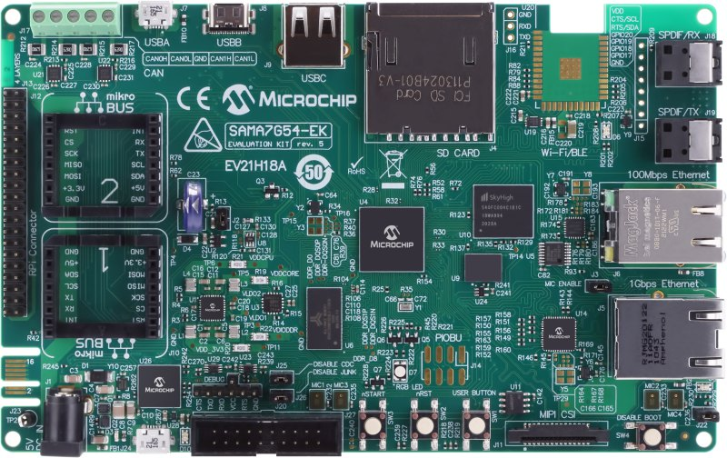
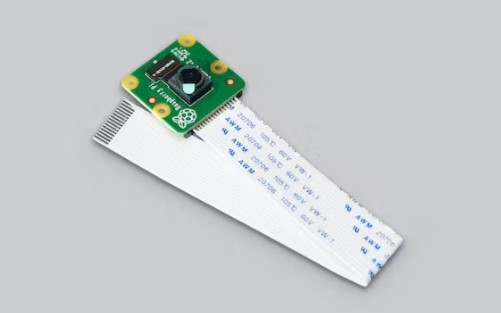

# Camera Demo using SAMA7G54-EK board

This application capture a raw video frame of VGA resolution from Sony IMX219 camera module using MIPI CSI2 interface and save the captured frame in a bmp file and copied to a USB drive using SAMA7G54-EK target board.

|MPLABX Configuration|Board Configuration|
|:-------------------|:------------------|
|[libcamera_usb_sama7g54_ek.X](./firmware/libcamera_usb_sama7g54_ek.X/readme.md)| [SAMA7G54-EK Board](https://www.microchip.com/en-us/development-tool/ev21h18a) using the MIPI CSI interface to capture video frames from the [Sony IMX219 Camera Module](https://www.raspberrypi.com/products/camera-module-v2/) and USB Flash drive of FAT filesystem |

|Hardware components|Images|Details|
|:-------------------|:------------------|:------------------|
| Development Board |  | [SAMA7G54-EK](https://www.microchip.com/en-us/development-tool/ev21h18a)|
| Camera Module |  | [imx219 image sensor](https://www.raspberrypi.com/products/camera-module-v2/) |

