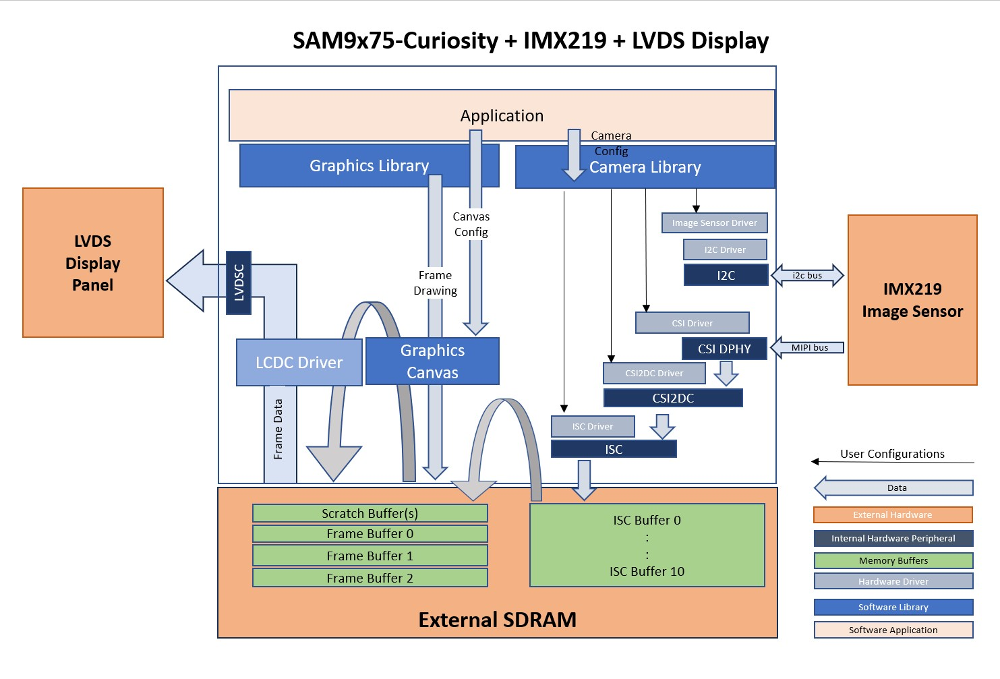
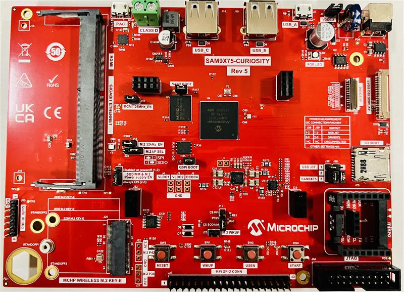
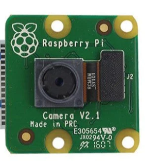
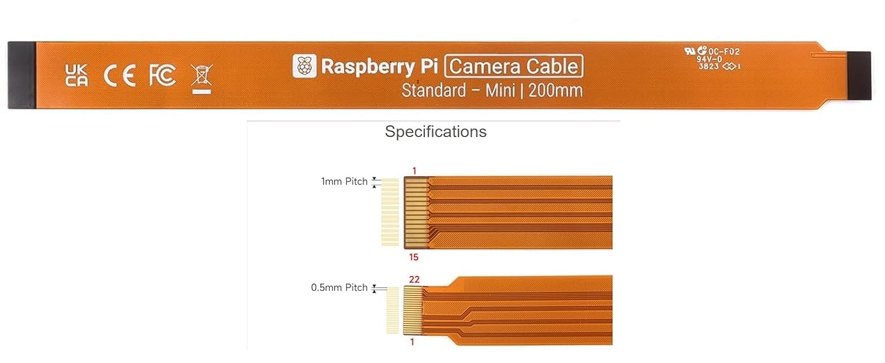
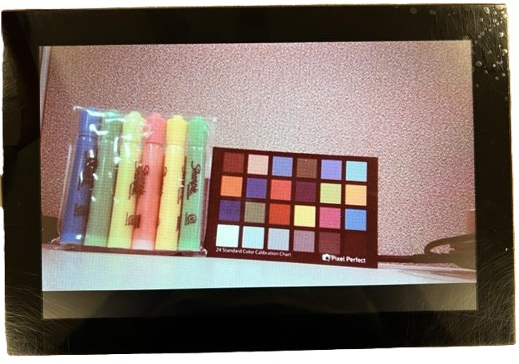
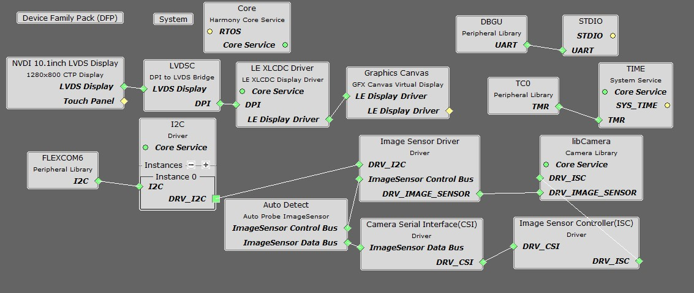
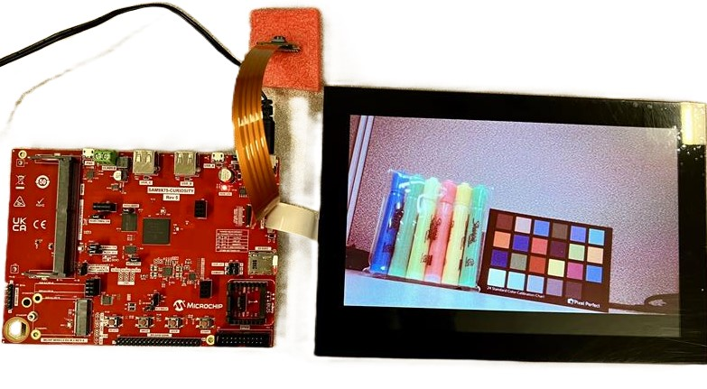

libcamera_lvds_newvision.X

Defining the Architecture
-------------------------

This application demonstrates the integration and functionality of MIPI CSI, CSI2DC, ISC, and LVDS peripherals. It utilizes Sony IMX219 image sensor as the camera module and the 10-inch NewVision LVDS display. The primary function of this application is to capture raw video frames at 720p resolution directly from the Sony IMX219 camera module via the MIPI CSI2 interface. After capturing, the video frames undergo a post-processing sequence through the Sam9x75 Image Sensor Controller (ISC) before being displayed on the 10-inch NewVision LVDS screen. The entire process is efficiently managed by the SAM9x75-Curiosity board, ensuring smooth and effective operation.

|Hardware components|Images|Details|
|:-------------------|:------------------|:------------------|
| Development Board |  | [SAM9x75-Curiosity](https://www.microchip.com/en-us/development-tool/EV31H43A)|
| Camera Module |  | [imx219 image sensor](https://www.raspberrypi.com/products/camera-module-v2/) |
| camera Cable |  | [Camera Cable](https://a.co/d/do5Gegh) is specifically designed for MIPI camera module with one end is 15 Pin 1.0mm Pitch interface and the other end is 22 Pin 0.5mm interface|
| NewVision LVDS display |  | [NewVision LVDS Display 1280x800](https://www.microchipdirect.com/dev-tools/AC69T88A?allDevTools=true)|

### Demonstration Features

-   Reference application for the SAM9X75-Curiosity Board
-   Image Sensor Controller (ISC) driver
-   MIPI CSI2 DPHY, and CSI2DC drivers 
-   Time system service, RTT peripheral library and driver
-   Graphics Acceleration using integrated display controller (XLCDC)
-   GFX2D GPU Driver Support
-   I2C and maXTouch® controller driver

Creating the Project Graph
--------------------------
The Project Graph illustrate the various Harmony components incorporated within this application. Interconnecting lines represent dependencies, where one component requires a functionality provided by another.

The pin configuration has been established using the MCC Pin Configuration tool as follows:

|Pin ID|Custom Name|Function|Direction|Latch|Open Drain|PIO Interrupt|Pull Up|Pull Down|Glitch/Debounce Filter|Slew Rate Control|Drive Strength
|:-----------|:-------|:----------|:----------|:----------|:----------|:-----------|:-------|:----------|:----------|:----------|:----------|
|PA17|LCD_DISP|GPIO|Out|High|No|Disabled|No|No|Disabled|No|Low|
|PA24||FLEXCOM6_IO0|n/a|n/a|Yes|Disabled|No|No|Disabled|No|Low|
|PA25||FLEXCOM6_IO1|n/a|n/a|No|Disabled|No|No|Disabled|No|Low|
|PA26||DBGU_DRXD|n/a|n/a|No|Disabled|No|No|Disabled|No|Low|
|PA27||DBGU_DTXD|n/a|n/a|No|Disabled|No|No|Disabled|No|Low|
|PC15|CAMERA_PWD|GPIO|Out|Low|No|Disabled|No|No|Disabled|No|Low|
|PC18|LCD_BACKLIGHT|GPIO|Out|High|No|Disabled|No|No|Disabled|No|Low|
|PC19|CAMERA_RESET|GPIO|Out|High|No|Disabled|No|No|Disabled|No|Low|
|PC30|LDC_MODULE_ENABLE|GPIO|Out|High|No|Disabled|No|No|Disabled|No|Low|

Clock Configuration
--------------------------
The peripheral clocks need to be turned on for "CSI", "CSI2DC", "DBGU" "FLEXCOM6","ISC", "XLCDC", "LVDSC", "PIOA", "PIOB", "PIOC", "PIOD" and "RTT".

The Generic clocks need to be turned on for "MIPIPHY" with GCLKCSS is set to MCK and GCLKDIV value set to 9.

The LVDSPLL is enabled with configuration values set as MUL = 28, FRACR= 699,051 and DIVPMC = 3

Interrupts Configuration
--------------------------
The interrupts should be enabled in the "Interrupt for "Enable-1--RTT", "Enable-52--CSI to Demultiplexer Controller(CSI2DC)", "Enable-1--FLEXCOM6" and "Enable-43--Camera interface(ISC)".

<b>Note:The IMX219 image sensor module is a commercially available component that does not receive official support from MPLAB Harmony 3. Although a driver for this module is provided within the scope of this demonstration, there is no assurance of its comprehensiveness. Furthermore, the configuration parameters for the IMX219 are not assured to be the most effective. The main objective of this application is to showcase the capabilities of the CSI, CSI2DC, ISC, XLCDC and LVDS peripherals. </b>

Project Configurations
---------------------
MPU32"s do not have an internal flash memory to boot from. Hence the boot process for these mpu's is different 
than for flash based MCUs. The boot process is described in detail in the device datasheets, but the general flow is as 
follows:
1. On power-up the device executes the first stage bootloader from internal ROM. This looks for an second stage bootloader
on external non-volatile memory such as eMMC, SD, NAND flash, NOR-SPI and QSPI as second stage boot devices. For SD and eMMC,
ROM bootloader expects a file named “boot.bin” to reside in the root directory of a FAT file system.
2. The second stage bootloader is copied to on-chip SRAM and executed. The second stage boot loader initialize the external
DRAM and its controller, then load other program from external non-volatile memory into DRAM and execute it. The second stage
bootloader must be configured for the board in use and for the external NVM containing the application.
A comprehensive description of the boot process for the Microchip MPU's can be found in this application note: 
https://ww1.microchip.com/downloads/en/AppNotes/AN2791-Booting-from-External-Non-Volatile-Memory-on-SAMA5D2-MPU-Application-Note-DS00002791A.pdf
3. The vision application is linked to run/debug on the external DRAM. During a debug process, MPLAB X will first run (load) the at91bootstrap program and this file can be found in the <project>.X folder whose function is to initialize the chip, its clocks, debug port to view log messages and initialize the external DRAM.

Below are Project configuration steps to Debug or Run Vision application.
On the MPLAB X IDE, right click on the project and click “Properties”.
1. In “Connected Hardware Tool”, select JLink or J-Tag, and in “Compiler Toolchain”, select XC32 and click apply.
2. Under Categories, click on “Bootstrap”, ensure that “Use bootstrap” is checked and the path to the bootstrap.elf file is set. 
3. The harmony.bin should be generated as a post-build command. Under Categories, click on "Building", ensure that "Execute this line after build" is checked and set "\$\{MP_CC_DIR\}/xc32-objcopy -O binary \$\{DISTDIR\}\/\$\{PROJECTNAME\}.\$\{IMAGE_TYPE\}.elf \$\{DISTDIR\}\/harmony.bin"

Building the Application
------------------------

The parent directory for this application is in vision/apps/sam9x75_curiosity. To build this application, use MPLAB X IDE to open the vision/apps/sam9x75_curiosity/libcamera_lvds_newvision.X project and press F11.

If the build is successfull, then a harmony.bin file is generate in vision/apps/sam9x75_curiosity/libcamera_lvds_newvision.X/dist/imx219_mipi_csi_isc_sam9x75_curiosity_lvds_ac69t88a/production folder.

The following table lists configuration properties:

|Project Name|BSP Used|Description|
|:-----------|:-------|:----------|
|libcamera_lvds_newvision.X|[SAM9X75-Curiosity Board BSP](https://www.microchip.com/en-us/development-tool/EV31H43A) |[SAM9X75-Curiosity Board](https://www.microchip.com/en-us/development-tool/EV31H43A) using the MIPI CSI interface to capture video frames from the [Sony IMX219 Camera Module](https://www.raspberrypi.com/products/camera-module-v2/) and [MPU32-LVDS-Display]()|

Prebuilt binaries 
-------------------------
Latest release prebuilt binaries are available for a [SAM9X75-Curiosity](https://www.microchip.com/en-us/development-tool/EV31H43A) board is [here](https://microchiptechnology-my.sharepoint.com/:u:/g/personal/sandeepsheriker_mallikarjun_microchip_com/EZSReLNnjA1Kqf89YBi70UAB1tfx59QT_fMkpfkZDYPUfg?e=1pOir4)

Configuring the Hardware
------------------------

Configure the hardware as follows:

-	Connect the ribbon cable from the IMX219 camera module to the MIPI CSI Interface (J25) on the SAM9X75-Curiosity board.

-	Connect the AC69T88A display to LVDS DSI Display connector (j26) using a 30-pin 0.5mm pitch FFC ribbon.   **Important**: You may need a Type A FFC (upto REV2), or a Type D FFC (contacts on opposite sides). Ultimately, you need to align pin 1 of the SAM9X75-Curiosity connector (j26) to pin 1 of the AC69T88A display.

-	Take an Micro SD Card formatted with the FAT32 file system and copy the boot.bin binary file from vision/apps/sam9x75_curiosity/libcamera_lvds_newvision.X/at91bootstrap folder. and copy the harmony.bin file generated from the "Building the Application" section.

-	Insert the Micro SD card into the SD Boot slot (J12) on the SAM9X75-Curiosity Board and power up the board by connecting a USB cable (5V/1A recommended) to the USB port (J2)or an adapter to the barrel jack (J1) (5V/1A recommended, Center Positive).

-	If you need access to debug logs, you have the option to connect an FTDI UART-to-USB adapter cable to the J32 interface.

Running the Demonstration
-------------------------
Upon successful power-on, the LCD is expected to exhibit a live feed from the camera. Please refer to the provided reference image.

* * * * *
