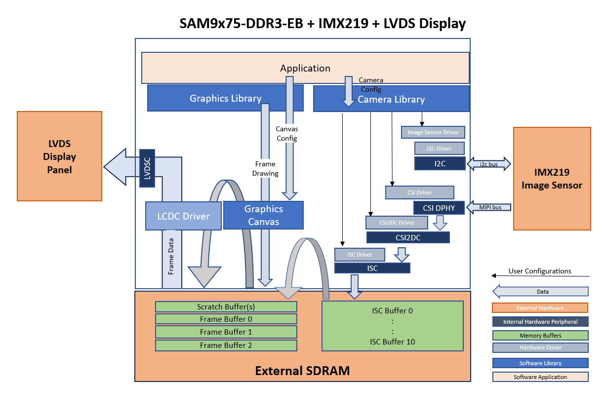
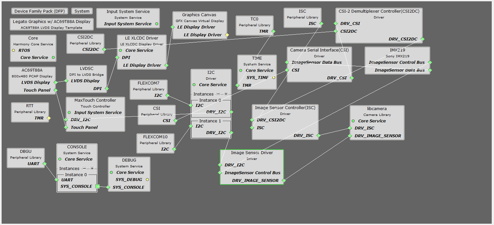
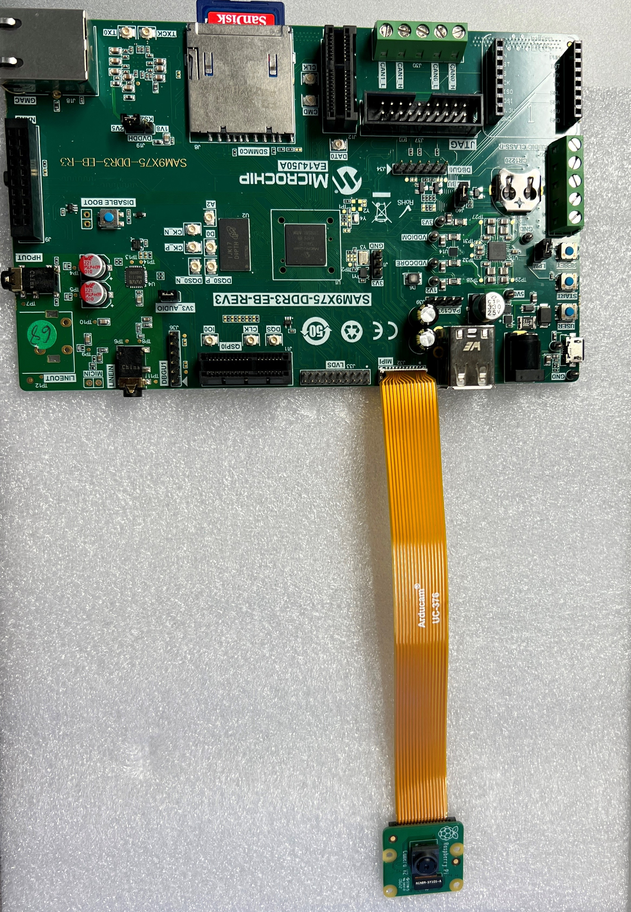
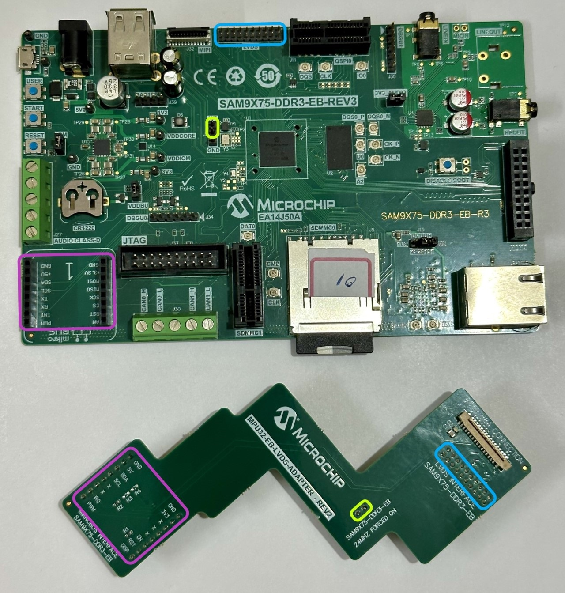

libcamera\_lvds\_sam9x75\_eb.X

Defining the Architecture
-------------------------

This application demonstrates the use of  MIPI CSI DPHY, CSI2DC, ISC and LVDS peripherals. The camera module used in this application is Sony IMX219 image sensor and AC69T88A LVDS display. This application capture raw video frames of VGA resolution from Sony IMX219 camera module using MIPI CSI2 
interface and display the captured frames on the LVDS display using SAM9x75-DDR3-EB target board.

 

The camera module can be purchased from [this](https://www.adafruit.com/product/3099?src=raspberrypi) link.

 

[Ribbon Cable](https://www.amazon.com/dp/B085RW9K13?ref_=cm_sw_r_apin_dp_T969WPBQ2K966HQHVAYZ) The ribbon cable 5.9"(150mm) is specifically used with MIPI camera module one end is 15 Pin and other end is 22 Pin interface 

### Demonstration Features

-   Reference application for the SAM9X75-DDR3-EB Early Access Evaluation Board
-   Image Sensor Controller (ISC) driver
-   MIPI CSI2 DPHY, and CSI2DC drivers 
-   Time system service, RTT peripheral library and driver
-   Graphics Acceleration using integrated display controller (XLCDC)
-   GFX2D GPU Driver Support
-   I2C and maXTouch® controller driver

Creating the Project Graph
--------------------------

The Project Graph diagram shows the Harmony components that are included in this application. Lines between components are drawn to satisfy components that depend on a capability that another component provides.

The I2C driver in this project is used for communication with the IMX219 image sensor.

The pins are configured as follows through the MCC Pin Configuration tool:

|Pin ID|Custom Name|Function|Direction|Latch|Open Drain|PIO Interrupt|Pull Up|Pull Down|Glitch/Debounce Filter|Slew Rate|Drive Strength|
|:-----------|:-------|:----------|:----------|:----------|:----------|:-----------|:-------|:----------|:----------|:----------|:----------|
|PC20|LED_RGB_B|GPIO|Out|Low|No|Disabled|No|No|disabled|No|Low|
|PC16| |FLEXCOM10_IO0|n/a|n/a|No|Disabled|No|No|Disabled|No|Low|
|PC23|USER_BUTTON|GPIO|In|n/a|No|Disabled|No|Yes|Disabled|No|Low|
|PC0|AC69T88A_TOUCH_SDL|FLEXCOM7_IO0|n/a|n/a|No|Disabled|No|No|Disabled|No|Low|
|PC15|CAMERA_RESET|GPIO|Out|Low|No|Disabled|No|No|Disabled|No|Low|
|PC21|AC69T88A_BACKLIGHT_EN|GPIO|Out|Low|No|Disabled|No|No|Disabled|No|Low|
|PC19|LED_RGB_R|GPIO|Out|Low|No|Disabled|No|No|Disabled|No|Low|
|PC1|AC69T88A_TOUCH_SDA|FLEXCOM7_IO1|n/a|n/a|No|Disabled|No|No|Disabled|No|Low|
|PC17| |FLEXCOM10_IO1|n/a|n/a|No|Disabled|No|No|Disabled|No|Low|
|PC31|BSP_MAXTOUCH_CHG|GPIO|In|n/a|No|Disabled|No|No|Disabled|No|Low|
|PA30|AC69T88A_DISPLAY_EN|GPIO|Out|High|No|Disabled|No|No|Disabled|No|Low|
|PA27||DBGU_DTXD|n/a|n/a|No|Disabled|No|No|Disabled|No|Low|
|PA26||DBGU_DRXD|n/a|n/a|No|Disabled|No|No|Disabled|No|Low|
|PA14|AC69T88A_PWR_EN|GPIO|Out|High|No|Disabled|No|No|Disabled|No|Low|

Clock Configuration
--------------------------
The peripheral clocks need to be turned on for "CSI", "CSI2DC", "DBGU" "FLEXCOM7", "FLEXCOM10" "ISC", "XLCDC", "LVDSC", "PIOA", "PIOB", "PIOC", "PIOD" and "TC0".

The Generic clocks need to be turned on for "MIPIPHY" with GCLKCSS is set to MCK and GCLKDIV value set to 9.

The LVDSPLL is enabled with configuration values set as MUL = 20, FRACR= 3,670,016 and DIVPMC = 2

Interrupts Configuration
--------------------------
The interrupts should be enabled in the "Interrupt for "CSI", "CSI2DC", "DBGU" "FLEXCOM7", "FLEXCOM10" "ISC", "XLCDC", "LVDSC", "PIOA", "PIOB", "PIOC", "PIOD" and "TC0".

<b>Note:  The IMX219 image sensor is an off-the-shelf module and is not officially supported by MPLAB Harmony 3. While a driver for this module is included as part of this demo, it is not guaranteed to be complete. Nor are the IMX219 configuration values guaranteed to be optimal. The primary purpose of this application is to demonstrate the functionality of the CSI2DC and Image Sensor Controller modules. </b>

Building the Application
------------------------

The parent directory for this application is in vision/apps/ibcamera_display. To build this application, use MPLAB X IDE to open the vision/apps/libcamera_display/firmware/libcamera_lvds_sam9x75_eb.X project and press F11.

If the build is successfull, then a harmony.bin file is generate in vision/apps/libcamera_display/firmware/libcamera_lvds_sam9x75_eb.X/dist/imx219_mipi_csi_isc_ac69t88a/production folder.

The following table lists configuration properties:

|Project Name|BSP Used|Description|
|:-----------|:-------|:----------|
|libcamera\_lvds\_sam9x75\_eb.X|[SAM 9X75 Evaluation Board BSP](https://www.microchip.com/en-us/development-tool/EA14J50A) |[SAM9X75-DDR3-EB Early Access Evaluation Board](https://www.microchip.com/en-us/development-tool/EA14J50A) using the MIPI CSI interface to capture video frames from the [Sony IMX219 Camera Module](https://www.raspberrypi.com/products/camera-module-v2/) with [MPU32-EB-LVDS-ADAPTER](https://www.microchip.com/) and [MPU32-LVDS-Display-WVGA](https://www.microchip.com/)|

Note: For information about MPU32-EB-LVDS-ADAPTER board and MPU32-LVDS-DISPLAY-WVGA contact Microchip sales team. 

Configuring the Hardware
------------------------

Configure the hardware as follows:

-	Connect the ribbon cable from the IMX219 camera module to the MIPI CSI connector on the SAM9x75-DDR3-EB board.

-	Connect the MPU32-EB-LVDS-ADAPTER - REV2 add-on board to the SAM 9X75 Evaluation Board. Make sure to remove any jumpers on the marked areas and start by inserting the mikroBUS header first for easy alignment.

-   Connect the AC69T88A display to the MPU32-EB-LVDS-ADAPTER-REV2 add-on board using a 30-pin 0.5mm pitch FFC ribbon.   **Important**: You may need a Type A FFC (upto REV2), or on newer LVDS-Adapter boards, a Type D FFC (contacts on opposite sides). Ultimately, you need to align pin 1 of the adapter to pin 1 of the display.

-	Take an SD Card formatted with the FAT32 file system and copy the boot.bin binary file from vision/apps/libcamera_display/firmware/libcamera_lvds_sam9x75_eb.X/binaries folder. and copy the harmony.bin file generated from the "Building the Application" section.

-   Insert the SD card into the SDMMC0 slot on the SAM9X75-DDR3-EB Early Access Evaluation Board and power up the board by connecting a USB cable (5V/1A recommended) to the USB port or an adapter to the barrel jack (5V/1A recommended, Center Positive).

-   You can optionally connect an FTDI UART to USB adapter cable to J34.

Running the Demonstration
-------------------------
The LCD should display a Live camera feed on successful power-on. See reference image.

* * * * *
